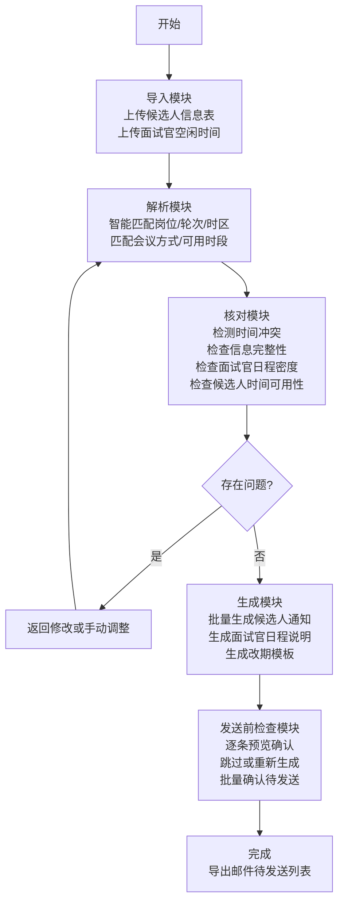

## 1. 产品概述

面试安排自动化工具，为人力资源人员提供批量整理面试安排邮件的一站式解决方案。解决传统人工安排面试中存在的时间冲突、信息遗漏、效率低下等问题，通过智能化匹配和自动化生成，大幅提升面试安排效率和准确性。

- 核心目标：将面试安排流程从数小时缩短至数分钟，减少人为错误，提升候选人体验
- 目标用户：企业人力资源专员、招聘团队成员、行政助理
- 市场价值：在企业招聘旺季，面试安排是高频重复劳动，自动化工具可显著降低人力成本，提高招聘效率

## 2. 核心 Features

### 2.1 用户角色

| 角色 | 注册方式 | 核心权限 |
|------|----------|----------|
| HR用户 | 企业账号登录 | 导入数据、解析匹配、核对检查、生成邮件、发送前确认 |

### 2.2 Feature 模块

本工具为单页面应用（SPA），包含5个核心功能模块，通过标签页切换：

1. **导入模块**：候选人信息表导入、面试官空闲时间表导入、数据格式校验
2. **解析模块**：岗位匹配、轮次匹配、时区转换、会议方式匹配、时间段智能匹配
3. **核对模块**：冲突检测、信息完整性检查、面试官日程密度检查、候选人时间可用性检查
4. **生成模块**：候选人面试通知批量生成、面试官日程说明生成、改期模板生成
5. **发送前检查模块**：待确认项汇总、逐条预览、单条跳过、单条重新生成

### 2.3 Page Details

| 页面名称 | 模块名称 | Feature 描述 |
|----------|----------|--------------|
| 主页面 | 顶部导航 | 应用logo、模块切换标签、帮助按钮、用户信息 |
| 主页面 | 导入模块 | Excel/CSV文件拖拽上传、数据预览表格、导入状态反馈、格式错误提示 |
| 主页面 | 解析模块 | 匹配规则配置、匹配进度可视化、匹配结果展示、手动调整匹配项 |
| 主页面 | 核对模块 | 问题分类展示（冲突/缺失/过密/不可用）、问题详情面板、一键跳转修改、批量修复建议 |
| 主页面 | 生成模块 | 邮件模板选择、变量预览、批量生成进度、生成结果列表 |
| 主页面 | 发送前检查 | 待确认项统计、邮件内容预览、操作按钮组（确认/跳过/重新生成）、批量确认 |

## 3. 核心流程

用户从导入数据开始，经过解析匹配、核对检查、生成邮件，最后进行发送前确认。整个流程线性推进，各模块间可自由跳转回溯。

## 4. 用户界面设计

### 4.1 设计风格

**设计理念：专业、高效、可信赖**

采用企业级SaaS产品的专业设计风格，强调数据的清晰展示和操作的流畅性。整体色调以深蓝为主色，搭配浅灰背景，突出专业感和信任感。

- **主色调**：#1E40AF（深靛蓝）- 代表专业和可信赖
- **辅助色**：#0EA5E9（天蓝色）- 用于操作按钮和交互元素
- **成功色**：#10B981（翡翠绿）- 用于成功状态和通过检查
- **警告色**：#F59E0B（琥珀黄）- 用于需要注意的提示
- **错误色**：#EF4444（珊瑚红）- 用于冲突和错误状态
- **中性色**：#F8FAFC（极浅灰背景）、#E2E8F0（边框）、#64748B（次要文字）、#1E293B（主要文字）

**按钮风格**：
- 主按钮：圆角6px，微阴影（box-shadow: 0 1px 3px rgba(0,0,0,0.1)），悬停时有轻微上浮动效
- 次要按钮：描边样式，悬停时填充背景色
- 图标按钮：圆角4px，紧凑尺寸

**字体选择**：
- 标题字体："Noto Sans SC", system-ui - 清晰现代的中文无衬线字体
- 正文字体："Noto Sans SC", system-ui - 确保中文显示清晰
- 等宽字体："JetBrains Mono", "Consolas" - 用于时间、代码等特殊信息展示
- 字体层级：H1 (24px, 700), H2 (20px, 600), H3 (16px, 600), Body (14px, 400), Small (12px, 400)

**布局风格**：
- 顶部导航 + 标签页切换 + 主内容区的经典企业级布局
- 卡片式模块组织，清晰的视觉层次
- 数据密集区域采用表格展示，配合筛选和搜索功能
- 充足的留白（24px标准间距），避免信息过载

**图标风格**：
- 使用 Lucide React 图标库，线性风格，统一20px尺寸
- 图标与文字间距4px，保持视觉平衡
- 重要操作图标使用填充色强调

**动效设计**：
- 页面切换：300ms 淡入淡出 + 轻微上移动效
- 数据加载：骨架屏占位 + 内容渐入
- 操作反馈：按钮点击缩放（95%）、成功/错误消息滑入
- 进度展示：步骤指示器动画，完成状态打钩动效

### 4.2 Page Design Overview

| 页面名称 | 模块名称 | UI Elements |
|----------|----------|-------------|
| 主页面 | 顶部导航 | 深蓝色背景，左侧logo+标题，右侧帮助图标和用户头像，高度64px |
| 主页面 | 标签导航 | 5个标签水平排列，激活态底部蓝色下划线，悬停背景浅蓝，间距32px |
| 主页面 | 导入模块 | 大尺寸拖拽区域（虚线边框，浅蓝色背景），拖拽时背景加深，文件预览表格，状态徽章 |
| 主页面 | 解析模块 | 左侧匹配规则面板，右侧匹配结果列表，匹配进度条，匹配状态颜色编码 |
| 主页面 | 核对模块 | 问题统计卡片（4色分别代表4类问题），问题列表带筛选，问题详情侧边滑入面板 |
| 主页面 | 生成模块 | 模板选择器，变量映射表，生成进度环形图，生成结果可展开预览 |
| 主页面 | 发送前检查 | 待确认项统计条，预览区左右分栏（左侧列表+右侧内容），操作按钮组固定底部 |

### 4.3 响应式设计

采用桌面端优先设计，同时适配中等屏幕：

- **桌面端（≥1280px）**：完整布局，侧边面板常驻，表格完整展示
- **中等屏幕（1024px-1279px）**：侧边面板改为可收起，表格列自适应压缩
- **平板端（768px-1023px）**：标签改为可横向滚动，表格支持横向滚动查看
- **移动端（<768px）**：堆叠式布局，标签改为底部导航，简化操作流程

**触摸优化**：
- 最小点击区域44x44px
- 表格支持横向滚动手势
- 下拉菜单增加点击热区
- 长按显示详情提示

### 4.4 数据可视化

- **进度展示**：线性进度条用于导入和生成过程，环形进度图用于整体完成度
- **状态指示**：彩色徽章（绿/黄/红/蓝）表示不同状态
- **冲突高亮**：冲突时间使用红色背景和闪烁边框动画
- **时间轴展示**：面试官日程使用时间轴可视化，密集时段自动收缩标注

**交互细节**：
- 表格行悬停高亮
- 可点击元素鼠标指针变化
- 表单输入聚焦时边框高亮
- 拖拽时的视觉反馈（区域高亮、文件缩略图）
