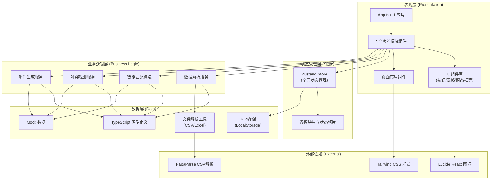
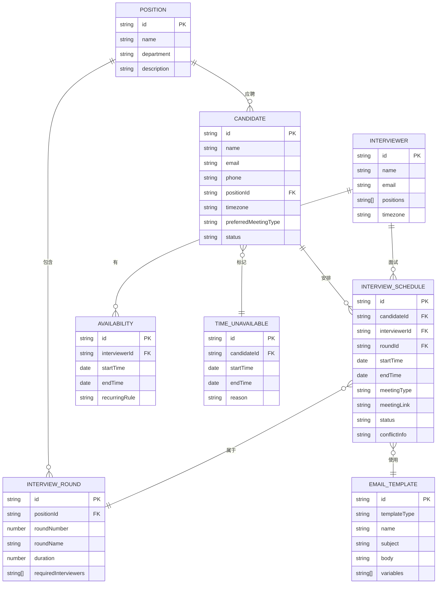

## 1. 架构设计

本项目为纯前端单页面应用（SPA），无需后端服务，所有数据处理和逻辑计算均在浏览器端完成。采用分层架构设计，确保代码可维护性和可扩展性。



## 2. 技术描述

### 2.1 技术栈选择

- **前端框架**：React@18.2.0 - 组件化开发，生态丰富，适合复杂交互应用
- **构建工具**：Vite@5.0.0 - 极速热更新，开箱即用的TypeScript支持
- **开发语言**：TypeScript@5.3.0 - 类型安全，提升代码质量和可维护性
- **样式方案**：Tailwind CSS@3.4.0 - 原子化CSS，快速构建一致的UI
- **状态管理**：Zustand@4.4.0 - 轻量级状态管理，API简洁，性能优异
- **图标库**：Lucide React@0.294.0 - 现代线性图标，风格统一
- **CSV解析**：PapaParse@5.4.1 - 强大的CSV解析库，支持大文件
- **Excel解析**：SheetJS (xlsx)@0.18.5 - 支持Excel文件导入解析

### 2.2 初始化方式

使用Vite官方脚手架初始化React+TypeScript项目：
```bash
npm create vite@latest interview-scheduler -- --template react-ts
```

### 2.3 后端服务

无后端服务，纯前端应用。数据存储使用浏览器LocalStorage进行本地持久化。

### 2.4 数据存储方案

- **运行时数据**：Zustand Store 内存状态管理
- **持久化数据**：LocalStorage 存储用户配置和未完成的工作
- **文件导入**：支持CSV和Excel格式，解析后转换为内部数据结构
- **导出功能**：支持导出CSV格式的面试安排表和邮件列表

## 3. 路由定义

本项目为单页面应用，使用React Router进行内部路由管理：

| 路由路径 | 页面/模块 | 功能说明 |
|----------|----------|----------|
| `/` | 主应用入口 | 重定向到导入模块 |
| `/import` | 导入模块 | 上传候选人信息和面试官时间表 |
| `/parse` | 解析模块 | 智能匹配和时间调度 |
| `/verify` | 核对模块 | 冲突检测和问题排查 |
| `/generate` | 生成模块 | 批量生成邮件和文档 |
| `/review` | 发送前检查模块 | 预览确认和最终检查 |

## 4. 数据模型

### 4.1 数据模型定义



### 4.2 核心类型定义（TypeScript）

```typescript
// 候选人信息
interface Candidate {
  id: string;
  name: string;
  email: string;
  phone: string;
  positionId: string;
  timezone: string;
  preferredMeetingType: 'video' | 'onsite' | 'phone';
  status: 'pending' | 'scheduled' | 'completed' | 'cancelled';
  unavailableTimes?: TimeRange[];
}

// 面试官信息
interface Interviewer {
  id: string;
  name: string;
  email: string;
  positions: string[];
  timezone: string;
  availabilities: Availability[];
}

// 可用时间段
interface Availability {
  id: string;
  startTime: string; // ISO 8601
  endTime: string;
  recurring?: 'daily' | 'weekly' | null;
}

// 时间范围
interface TimeRange {
  startTime: string;
  endTime: string;
}

// 面试安排
interface InterviewSchedule {
  id: string;
  candidateId: string;
  interviewerIds: string[];
  roundId: string;
  startTime: string;
  endTime: string;
  meetingType: 'video' | 'onsite' | 'phone';
  meetingLink?: string;
  location?: string;
  status: 'pending' | 'confirmed' | 'cancelled' | 'completed';
  conflicts?: ConflictInfo[];
}

// 冲突信息
interface ConflictInfo {
  type: 'time_conflict' | 'missing_contact' | 'interviewer_too_dense' | 'candidate_unavailable';
  severity: 'error' | 'warning';
  description: string;
  relatedIds: string[];
}

// 邮件模板
interface EmailTemplate {
  id: string;
  type: 'candidate_invite' | 'interviewer_notice' | 'reschedule';
  name: string;
  subject: string;
  body: string;
  variables: string[];
}

// 生成的邮件
interface GeneratedEmail {
  id: string;
  scheduleId: string;
  type: 'candidate_invite' | 'interviewer_notice' | 'reschedule';
  to: string;
  cc?: string;
  subject: string;
  body: string;
  status: 'draft' | 'reviewed' | 'skipped' | 'ready';
}

// 全局应用状态
interface AppState {
  // 数据
  candidates: Candidate[];
  interviewers: Interviewer[];
  positions: Position[];
  schedules: InterviewSchedule[];
  templates: EmailTemplate[];
  generatedEmails: GeneratedEmail[];
  
  // 流程状态
  currentStep: 'import' | 'parse' | 'verify' | 'generate' | 'review';
  importStatus: {
    candidates: 'idle' | 'loading' | 'success' | 'error';
    interviewers: 'idle' | 'loading' | 'success' | 'error';
  };
  parseProgress: number;
  verifyResults: ConflictInfo[];
  
  // 操作方法
  importCandidates: (file: File) => Promise<void>;
  importInterviewers: (file: File) => Promise<void>;
  runMatching: () => Promise<void>;
  runVerification: () => ConflictInfo[];
  generateEmails: () => Promise<void>;
  updateEmailStatus: (id: string, status: GeneratedEmail['status']) => void;
  regenerateEmail: (id: string) => void;
}
```

## 5. 目录结构

```
interview-scheduler/
├── src/
│   ├── components/          # 可复用UI组件
│   │   ├── ui/              # 基础UI组件（Button, Table, Modal等）
│   │   ├── layout/          # 布局组件
│   │   └── shared/          # 业务共享组件
│   ├── modules/             # 5个功能模块
│   │   ├── ImportModule/
│   │   ├── ParseModule/
│   │   ├── VerifyModule/
│   │   ├── GenerateModule/
│   │   └── ReviewModule/
│   ├── store/               # Zustand状态管理
│   │   └── useAppStore.ts
│   ├── types/               # TypeScript类型定义
│   │   └── index.ts
│   ├── services/            # 业务逻辑服务
│   │   ├── fileParser.ts    # 文件解析服务
│   │   ├── matcher.ts       # 智能匹配算法
│   │   ├── verifier.ts      # 核对检测服务
│   │   └── emailGenerator.ts # 邮件生成服务
│   ├── data/                # Mock数据和常量
│   │   ├── mockData.ts
│   │   └── templates.ts
│   ├── utils/               # 工具函数
│   │   ├── dateUtils.ts
│   │   ├── timezoneUtils.ts
│   │   └── stringUtils.ts
│   ├── hooks/               # 自定义Hooks
│   │   ├── useDragDrop.ts
│   │   └── useProgress.ts
│   ├── App.tsx
│   ├── main.tsx
│   └── index.css
├── public/
├── package.json
├── tsconfig.json
├── vite.config.ts
└── tailwind.config.js
```

## 6. 核心算法说明

### 6.1 智能匹配算法（matcher.ts）

匹配优先级：
1. 岗位匹配：面试官需负责该岗位的面试
2. 轮次匹配：根据岗位定义的面试轮次安排
3. 时区匹配：转换为同一时区后匹配
4. 会议方式匹配：优先满足候选人偏好
5. 时间段匹配：使用贪心算法分配最早可用时段

### 6.2 冲突检测算法（verifier.ts）

四类检测：
1. **时间冲突**：检查面试官是否同时有多个安排
2. **信息缺失**：检查候选人联系方式是否完整
3. **日程过密**：检查同一面试官连续面试间隔是否<15分钟
4. **时间不可用**：检查候选人标记的不可用时段

### 6.3 邮件模板变量替换（emailGenerator.ts）

使用双大括号语法 `{{variable}}` 进行变量替换，支持的变量包括：
- `{{candidateName}}` - 候选人姓名
- `{{interviewerName}}` - 面试官姓名
- `{{positionName}}` - 岗位名称
- `{{interviewTime}}` - 面试时间（含时区转换）
- `{{meetingLink}}` - 会议链接
- `{{roundName}}` - 面试轮次名称
